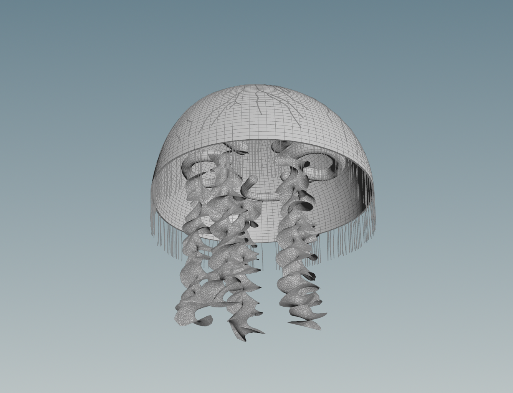
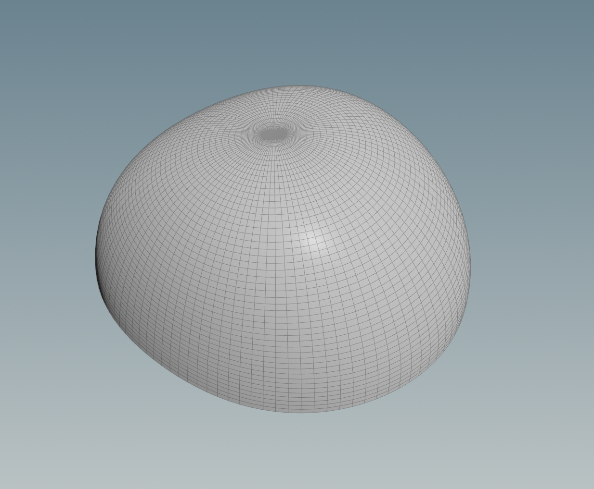
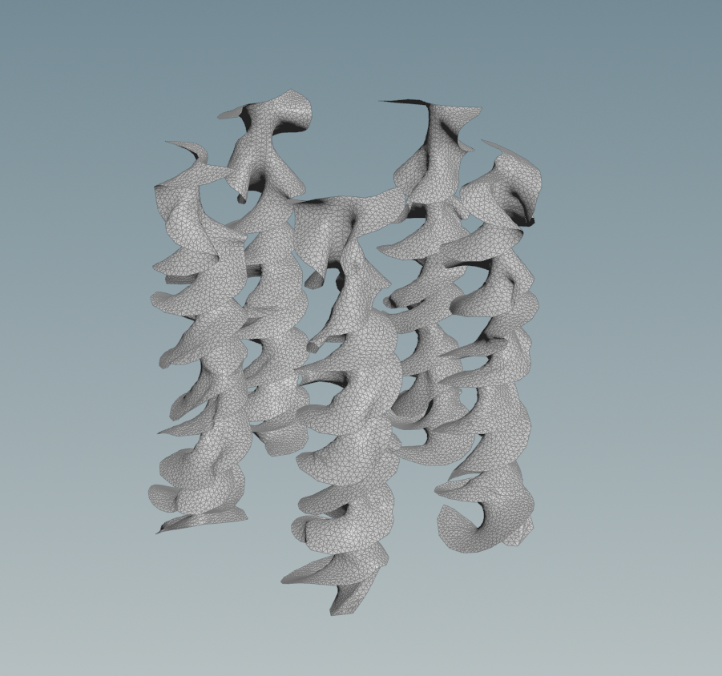
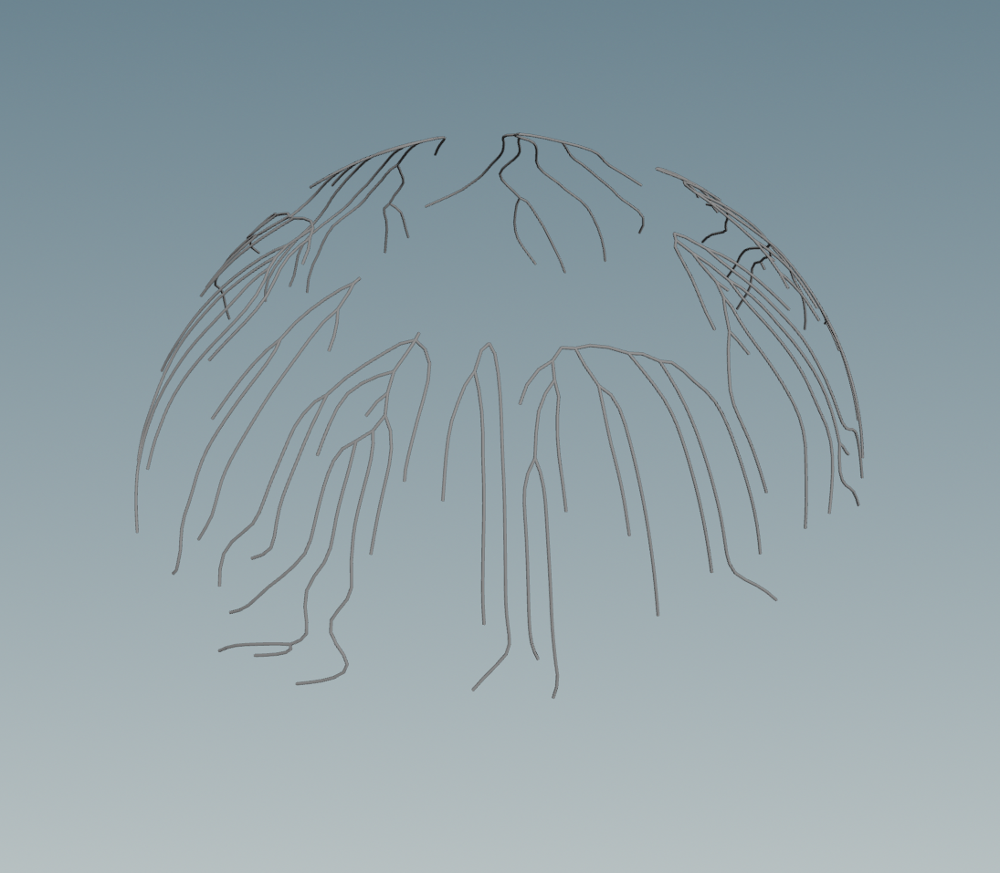
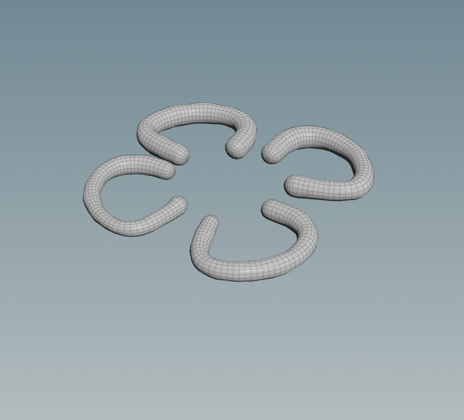
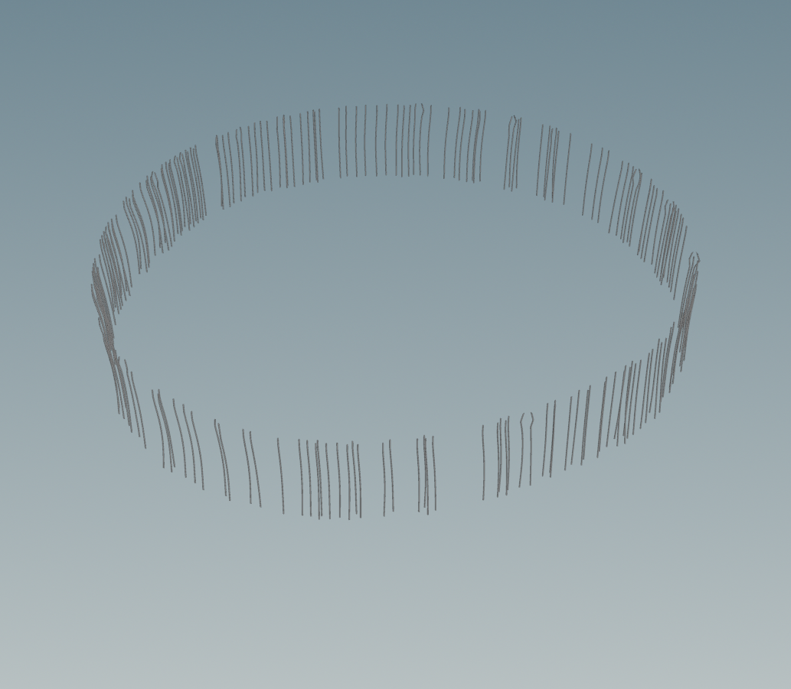

# Procedural Jellyfish

## Project Overview

This project implements a procedural jellyfish in Houdini, featuring all the core components required for the assignment.

---

### Components Implemented

**Bell**: The main dome-shaped body of the jellyfish, made by revolving a curved profile line to form the bell shape, then adding noise for organic irregularity, extruding for thickness, and keyframing parameters to animate it.

Tutorial: [Jellyfish Bell Setup](https://www.youtube.com/watch?v=J3X8BB0yNRE)

**Arms**: It’s made from a deformed grid with ruffles added and twisted, simulated as vellum cloth with pinned points, attached to the bell, and animated through keyframed motion.

Tutorial: [Jellyfish Arms Setup](https://www.youtube.com/watch?v=A_oNXqx8XH4)

**Veins**: Vein patterns on the bell surface, created by remeshing the bell geometry, randomly selecting a vertical range of points with a wrangle to mark the ends, finding and smoothing the shortest paths, sweeping them into tentacle tubes, and using Point Deform to make them follow the bell’s animation

**Organs**:Organs built from edited curves that are resampled and mirrored, copied around the center, swept into thin tendrils, deformed with noise for organic motion, and driven by the bell’s animation through Point Deform

**Tentacles**: Tentacles created by scattering points on the bell surface, copying line segments onto them, simulating them as vellum hairs with pinned roots, and deforming and sweeping them to follow the bell’s animation.

Tutorial: [Hair Simulation Tutorial](https://www.youtube.com/watch?v=LN4XXaHQkmU)

## Demo Video

 [Watch on YouTube](https://youtu.be/eJxARy0pZQc)

---

*This project was completed as part of CIS 5660 coursework.*
